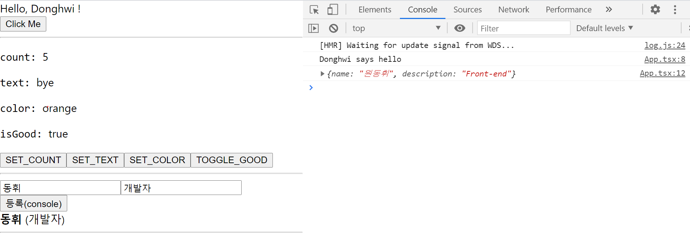

# React + TypeScript

## 기술 스택 

React (Hooks) , TypeScript 

Hooks => useState , useReducer , useRef

## React에 TypeScript를 적용해서 React Hooks를 학습하고 사용했습니다.

### [웹페이지 바로가기](https://wondonghwi.github.io/React_TypeScript_Hooks_Practice/)

< preview >

